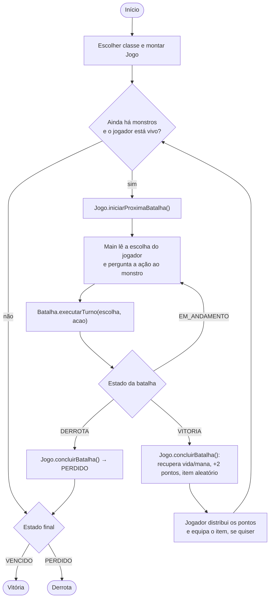

# Trabalho II — Arena: um RPG de combate por turnos

> Disciplina de Programação Orientada a Objetos. Trabalho **individual**, cobrindo **herança** ([Aula 05](../../Aula05/)) e **interfaces** ([Aula 06](../../Aula06/)), além de reforçar o que já foi visto nas Aulas 01 a 04 (encapsulamento, invariantes, `record`, coleções protegidas). Diferente do [Trabalho I](../Trabalho-I.md), aqui você **parte de uma modelagem proposta** (o diagrama da seção 4) e precisa implementá-la, respeitando as regras do jogo, e justificar suas decisões em vídeo.

## 1. Objetivo

Implementar, em Java e sem frameworks, um mini-RPG no console. O jogador controla **um personagem** (Guerreiro, Arqueiro ou Mago) que enfrenta, em sequência, **uma lista de monstros**. A cada vitória ele ganha um item aleatório e 2 pontos de atributo para distribuir. Se derrotar todos os monstros, vence o jogo; se morrer em qualquer batalha, perde.

O foco **não é o jogo em si**, e sim o uso correto dos conceitos de POO:

- **herança** onde existe uma relação "é um" de verdade (`Guerreiro` **é um** `Personagem`);
- **classes e métodos abstratos** para obrigar as subclasses a implementar o que é específico delas;
- **interfaces** para capacidades que atravessam a hierarquia (`Equipavel`, `Usavel`, `Habilidade`) e para algoritmos intercambiáveis (`EstrategiaDoMonstro`);
- **polimorfismo**: a batalha e o jogo nunca perguntam "qual a classe deste objeto?" — apenas mandam o objeto fazer o que sabe fazer;
- **composição**: um personagem *tem* inventário, atributos, equipamentos e habilidades.

## 2. Ligação com o que foi visto em aula

| Conceito | Onde aparece no jogo | Exemplo das aulas |
|---|---|---|
| Classe abstrata + método abstrato | `Personagem.atacar()`, `Item.descricao()`, `Monstro.getAtaqueEspecial()` | `Animal.alimenta()` (Aula 05) |
| Herança, `super` e sobrescrita | `Arqueiro.atacar()` chama `super.atacar()` e soma um bônus; `Guerreiro.receberDano()` reduz o dano antes de chamar `super` | `Gerente.getSalario()` (Aula 05) |
| Herança em mais de um nível | `Personagem` → `LutadorFisico` → `Guerreiro` / `Arqueiro` | `Usuario` → `Funcionario` (Aula 06) |
| Interface como capacidade | `Equipavel`, `Usavel`, `Combatente` | `Auditavel`, `PodeAprovarDespesa` (Aula 06) |
| Interface como estratégia | `Habilidade` e suas implementações; `EstrategiaDoMonstro` | `CalculadoraDePremio` (Aula 06) |
| Método `default` | `Habilidade.podeUsar()`, `Equipavel.bonusDeDano()` | `PodeAprovarDespesa.podeAprovar()` |
| Composição | `Personagem` possui `Inventario`, `Atributos`, equipamentos e habilidades | `Apolice` + calculadora |
| `record` e enum | `Atributos`, `EscolhaDoJogador`, `ResultadoDoTurno`; `Slot`, `Atributo`, `AcaoDoMonstro`... | Aula 03 / Aula 04 |

## 3. Regras do jogo

> Os números abaixo são **valores sugeridos**. Você pode ajustá-los para balancear o jogo, desde que mantenha **todas as regras de comportamento** e deixe os números em constantes nomeadas (nada de "números mágicos" espalhados).

### 3.1 Atributos e limites

- Todo personagem possui três atributos: **força**, **defesa** e **magia**, agrupados em `Atributos`.
- Existe um **limite máximo por atributo**, igual para **qualquer classe** de personagem (sugestão: `LIMITE_POR_ATRIBUTO = 20`). É impossível construir um `Atributos` acima do limite ou com valor negativo — a própria classe se protege.
- Cada classe começa com valores diferentes (tabela 3.2), mas o limite é o mesmo para todas.
- **A cada batalha vencida**, o jogador ganha **2 pontos** para distribuir entre os atributos, como quiser (por exemplo, 2 em força, ou 1 em defesa e 1 em magia).
  - Pontos não gastos **acumulam** para a próxima rodada.
  - Tentar colocar um ponto que ultrapasse o limite de um atributo deve ser **rejeitado** sem consumir o ponto.
  - Tentar gastar mais pontos do que os disponíveis deve ser **rejeitado**.

### 3.2 Classes de personagem

| Classe | Vida | Mana | Força | Defesa | Magia | Poções de vida iniciais | Habilidades iniciais |
|---|---|---|---|---|---|---|---|
| Guerreiro | 100 | 10 | 8 | 5 | 1 | **3** | Golpe Poderoso (`AtaqueFisico`), Postura Defensiva (`Buff`) |
| Arqueiro | 80 | 15 | 7 | 3 | 2 | **3** | Tiro Certeiro (`AtaqueFisico`) |
| Mago | 60 | 30 | 2 | 2 | 9 | 1 | Bola de Fogo (`Magia`), Cura (`Cura`) |

Regras que derivam dessa tabela:

- **Personagens baseados em ataque físico** (Guerreiro e Arqueiro) começam com **mais poções** que o Mago. Isso deve ser expresso **pela hierarquia** (a classe intermediária `LutadorFisico`), e não por um `if` na classe `Mago` ou na `Batalha`.
- **Nem todos os personagens têm cura**: a habilidade `Cura` existe apenas no `Mago`. Guerreiro e Arqueiro **não podem** curar-se por habilidade (apenas por poção). Tentar usar uma habilidade que o personagem não conhece deve ser rejeitado.
- **Ataque básico** (sem custo de mana). O dano bruto de cada classe é:
  - `Guerreiro`: força + bônus de dano dos equipamentos.
  - `Arqueiro`: força + bônus de dano dos equipamentos + 3 (bônus de precisão, sobrescrevendo o ataque herdado).
  - `Mago`: magia + bônus de dano dos equipamentos.
- **Guerreiro** tem armadura natural: sobrescreve `receberDano` reduzindo o dano bruto recebido em 20% (arredondando para baixo) antes de aplicar a defesa.
- **Dano efetivo**: `max(1, danoBruto - defesaTotal)`, onde a defesa total é a defesa do atributo + bônus de defesa dos equipamentos + bônus temporário de `Buff`. Todo ataque que acerta causa **pelo menos 1** de dano. A vida nunca fica abaixo de 0 nem acima do máximo.

### 3.3 Habilidades

Toda habilidade implementa a interface `Habilidade` (nome, custo de mana, alvo e execução). Habilidades custam mana e só podem ser usadas se o personagem tiver mana suficiente.

| Implementação | Efeito | Alvo |
|---|---|---|
| `AtaqueFisico` | dano bruto = `(força + bônus de dano) × multiplicador` (sugestão: ×2, custo 5) | inimigo |
| `Magia` | dano bruto = `magia + poder` (sugestão: poder 10, custo 8) | inimigo |
| `Cura` | restaura `quantidade + magia` de vida (sugestão: quantidade 15, custo 6) | o próprio usuário |
| `Buff` | soma `bonusDefesa` à defesa por `turnos` turnos (sugestão: +3 por 3 turnos, custo 4) | o próprio usuário |

O `Buff` é a única habilidade com **estado ao longo do tempo**: o personagem precisa lembrar quanto bônus ainda tem e por quantos turnos (o método `encerrarTurno()` do `Personagem` faz esse desconto). Reaplicar o buff **renova** a duração, sem acumular o bônus.

### 3.4 Itens, inventário e equipamentos

- `Item` é abstrato. As subclasses são `Arma`, `Armadura` e `Consumivel` (também abstrata), com `PocaoDeVida` e `PocaoDeMana` como consumíveis concretos (sugestão: 30 de vida e 15 de mana).
- **`Equipavel`** é uma interface implementada por `Arma` e `Armadura`. Ela expõe o `Slot` onde o item é usado (`MAO`, `CORPO`, `CABECA`) e dois métodos `default`, `bonusDeDano()` e `bonusDeDefesa()`, que devolvem 0 — cada item sobrescreve apenas o que lhe interessa.
- **`Usavel`** é uma interface implementada por `Consumivel`: `usar(Personagem alvo)`. Um consumível, uma vez usado, **sai do inventário**.
- O **inventário** guarda itens; sua lista interna **não pode ser exposta** (Aula 03). Existe uma capacidade máxima de itens (sugestão: 10). Adicionar além da capacidade deve ser rejeitado de forma explícita — e a recompensa da batalha **não pode se perder em silêncio** (decida o que acontece e justifique no vídeo).
- Um personagem pode ter **um equipamento por slot**. Equipar em um slot ocupado **substitui** o antigo, que volta ao inventário.
- Itens são **imutáveis**; por isso a mesma instância de um item pode ser sorteada mais de uma vez sem causar problema.

### 3.5 Monstros

`Monstro` é abstrato e estende `Personagem`. Cada monstro concreto define seus valores e **obrigatoriamente** o seu ataque especial (método abstrato). Todo monstro começa com **1 poção de vida**.

| Monstro | Vida | Força | Defesa | Ataque especial (sugestão) |
|---|---|---|---|---|
| `Goblin` | 40 | 6 | 2 | Facada Dupla (`AtaqueFisico` ×2) |
| `Orc` | 70 | 9 | 4 | Golpe Esmagador (`AtaqueFisico` ×2) |
| `Dragao` | 150 | 12 | 6 | Sopro de Fogo (`Magia`, poder 15) |

Os ataques especiais dos monstros **não custam mana**.

**Comportamento do monstro** (quem decide a ação é uma `EstrategiaDoMonstro`, escolhida na criação do monstro):

- **Ataque especial só a partir do 2º turno**: no turno 1 ele jamais pode ser usado; a partir do turno 2 está disponível.
- **Poção**: o monstro só considera usar poção quando tem **vida baixa** (≤ 30% da vida máxima) **e** ainda tem poção. Mesmo assim, usa com **baixa probabilidade** (sugestão: 25%) — ao contrário do jogador, que decide livremente. Um monstro pode, portanto, morrer com poção na mochila.
- Nos demais casos, a `EstrategiaPadrao` sorteia entre ataque especial (sugestão: 40%, quando disponível) e ataque básico.
- Deve existir uma **segunda estratégia** (`EstrategiaBrutal`: nunca usa poção, usa o especial sempre que disponível) para demonstrar que o monstro **não conhece** a lógica de decisão — apenas delega para a interface.
- O sorteio usa um `java.util.Random` **recebido por construtor** (injeção), nunca um `Random` criado dentro da regra. Assim é possível reproduzir uma batalha com uma semente fixa.

### 3.6 A batalha — classe `Batalha`

A `Batalha` é a classe central do trabalho. Ela **não lê teclado, não imprime em console e não sorteia nada**: recebe tudo por parâmetro e devolve um resultado. Isso a torna testável e reaproveitável por qualquer interface (console, testes, futura interface gráfica).

```java
ResultadoDoTurno executarTurno(EscolhaDoJogador escolha, AcaoDoMonstro acaoDoMonstro)
```

- `EscolhaDoJogador` é um `record` com a ação (`AcaoDoJogador`: `ATACAR`, `USAR_HABILIDADE`, `USAR_POCAO_VIDA`, `USAR_POCAO_MANA`) e, quando a ação for `USAR_HABILIDADE`, a habilidade escolhida. O construtor do `record` impede combinações inválidas (habilidade ausente em `USAR_HABILIDADE`, ou presente nas outras ações).
- `AcaoDoMonstro` é um enum: `ATAQUE_BASICO`, `ATAQUE_ESPECIAL`, `USAR_POCAO`.

**Ordem de um turno**

1. **Validação de tudo antes de alterar qualquer estado.** Se alguma escolha for inválida, a `Batalha` lança exceção e **nada acontece** (o turno não é consumido, ninguém perde vida ou mana). São inválidos:
   - batalha já encerrada;
   - habilidade que o personagem não conhece;
   - mana insuficiente;
   - poção que o personagem (jogador ou monstro) não possui;
   - ataque especial do monstro no turno 1.
2. O jogador age.
3. Se o monstro morreu → a batalha termina em `VITORIA`.
4. O monstro executa a ação recebida.
5. Se o jogador morreu → a batalha termina em `DERROTA`.
6. Fim do turno: os dois combatentes chamam `encerrarTurno()` (desconto do buff) e o contador de turnos avança.

`ResultadoDoTurno` é um `record` com o número do turno, a lista de **eventos** (frases como `"Mago lança Bola de Fogo e causa 8 de dano"`) e o `EstadoDaBatalha` (`EM_ANDAMENTO`, `VITORIA`, `DERROTA`). Sua lista de eventos deve ser **imutável** (`List.copyOf`).

Para saber qual ação o monstro vai tomar, o código cliente (o `Main` ou o `Jogo`) pergunta ao monstro: `monstro.decidirAcao(jogador, batalha.getTurnoAtual())` — que delega para a estratégia — e repassa o resultado ao `executarTurno`. A `Batalha` não sorteia: se alguém quiser forçar uma ação específica (em um teste, por exemplo), basta passar o parâmetro.

### 3.7 O jogo completo — classe `Jogo`

O `Jogo` orquestra a campanha: recebe o jogador, a **lista de monstros** a derrotar (na ordem) e uma `TabelaDeRecompensas`.

- `iniciarProximaBatalha()` devolve uma `Batalha` contra o próximo monstro. Não pode haver duas batalhas ao mesmo tempo, nem iniciar nova batalha com o jogo encerrado.
- `concluirBatalha(Batalha)` aplica as consequências do resultado:
  - **Vitória**: o jogador recupera 50% da vida máxima (sem passar do máximo) e toda a mana; ganha **2 pontos de atributo**; recebe **um item aleatório** da `TabelaDeRecompensas`, que é **adicionado ao inventário** (e, se for um `Equipavel`, o jogador decide depois se equipa — a escolha é feita pelo `Main`). Se era o último monstro, o jogo termina em `VENCIDO`.
  - **Derrota**: o jogo termina em `PERDIDO`.
- O `EstadoDoJogo` (`EM_ANDAMENTO`, `VENCIDO`, `PERDIDO`) é consultável.
- A `TabelaDeRecompensas` recebe a lista de itens possíveis e um `Random` por construtor; `sortear()` devolve um item. A lista deve ter, no mínimo, **2 armas, 2 armaduras e 2 consumíveis** (os conteúdos são livres).

### 3.8 O `Main`

O `Main` é a **única** classe que conversa com o usuário (`Scanner`/`System.out`) e é a única que pode usar `System.in`. Ele deve:

1. Perguntar o nome e a classe do personagem;
2. Montar a lista de monstros e a tabela de recompensas;
3. Repetir: iniciar batalha → loop de turnos (mostrar status, ler a escolha do jogador, pedir a ação ao monstro, executar o turno, imprimir os eventos) → concluir batalha → distribuir os 2 pontos → equipar o item recebido, se desejar;
4. Ao final, imprimir `VITÓRIA` ou `DERROTA` com um resumo.

Entregue também um **segundo ponto de entrada**, `MainRoteirizado`, não interativo: usa `Random` com **semente fixa** e uma sequência **fixa** de escolhas do jogador, de modo que a saída seja **sempre a mesma**. Ele precisa demonstrar, no mínimo: uma batalha completa, uma tentativa de ataque especial do monstro no turno 1 sendo **rejeitada**, uma tentativa de usar `Cura` com um Guerreiro sendo **rejeitada**, e uma distribuição de pontos que estoura o limite de um atributo sendo **rejeitada**.

## 4. Diagrama de classes (modelagem proposta)

O diagrama abaixo é o **ponto de partida obrigatório**: os conceitos, as hierarquias e as interfaces devem ser mantidos. Você pode acrescentar classes, métodos auxiliares e campos privados que julgar necessários, mas **não pode remover nem fundir** classes do diagrama sem justificar no vídeo.

```mermaid
classDiagram
    direction TB

    %% ===== Interfaces =====
    class Combatente {
        <<interface>>
        +getNome() String
        +getVida() int
        +getDefesa() int
        +atacar(alvo Combatente) int
        +receberDano(danoBruto int) int
        +estaVivo() boolean
    }
    class Equipavel {
        <<interface>>
        +getSlot() Slot
        +bonusDeDano() int
        +bonusDeDefesa() int
    }
    class Usavel {
        <<interface>>
        +usar(alvo Personagem) void
    }
    class Habilidade {
        <<interface>>
        +getNome() String
        +getCustoMana() int
        +getAlvo() Alvo
        +executar(usuario Personagem, alvo Personagem) String
        +podeUsar(usuario Personagem) boolean
    }
    class EstrategiaDoMonstro {
        <<interface>>
        +decidir(monstro Monstro, jogador Personagem, turno int) AcaoDoMonstro
    }

    %% ===== Enums =====
    class Slot {
        <<enumeration>>
        MAO
        CORPO
        CABECA
    }
    class Atributo {
        <<enumeration>>
        FORCA
        DEFESA
        MAGIA
    }
    class Alvo {
        <<enumeration>>
        INIMIGO
        SI_MESMO
    }
    class AcaoDoJogador {
        <<enumeration>>
        ATACAR
        USAR_HABILIDADE
        USAR_POCAO_VIDA
        USAR_POCAO_MANA
    }
    class AcaoDoMonstro {
        <<enumeration>>
        ATAQUE_BASICO
        ATAQUE_ESPECIAL
        USAR_POCAO
    }
    class EstadoDaBatalha {
        <<enumeration>>
        EM_ANDAMENTO
        VITORIA
        DERROTA
    }
    class EstadoDoJogo {
        <<enumeration>>
        EM_ANDAMENTO
        VENCIDO
        PERDIDO
    }

    %% ===== Records =====
    class Atributos {
        <<record>>
        +int forca
        +int defesa
        +int magia
        +int LIMITE_POR_ATRIBUTO$
        +somar(atributo Atributo, pontos int) Atributos
        +valorDe(atributo Atributo) int
    }
    class EscolhaDoJogador {
        <<record>>
        +AcaoDoJogador acao
        +Habilidade habilidade
    }
    class ResultadoDoTurno {
        <<record>>
        +int numeroDoTurno
        +List~String~ eventos
        +EstadoDaBatalha estado
    }

    %% ===== Personagens =====
    class Personagem {
        <<abstract>>
        -String nome
        -int vidaMaxima
        -int vida
        -int manaMaxima
        -int mana
        -Atributos atributos
        -int pontosDisponiveis
        -int bonusTemporarioDeDefesa
        -int turnosDeBuff
        +atacar(alvo Combatente) int*
        +receberDano(danoBruto int) int
        +curar(quantidade int) void
        +recuperarMana(quantidade int) void
        +gastarMana(quantidade int) void
        +usarHabilidade(h Habilidade, alvo Personagem) String
        +usarPocaoDeVida() void
        +usarPocaoDeMana() void
        +equipar(e Equipavel) void
        +ganharPontos(pontos int) void
        +distribuirPontos(atributo Atributo, pontos int) void
        +aplicarBuff(bonus int, turnos int) void
        +encerrarTurno() void
        +getForcaTotal() int
        +getMagiaTotal() int
        +getBonusDeDano() int
        +getDefesa() int
        +estaVivo() boolean
    }
    class LutadorFisico {
        <<abstract>>
        +atacar(alvo Combatente) int
    }
    class Guerreiro {
        +receberDano(danoBruto int) int
    }
    class Arqueiro {
        +atacar(alvo Combatente) int
    }
    class Mago {
        +atacar(alvo Combatente) int
    }
    class Monstro {
        <<abstract>>
        +getAtaqueEspecial() Habilidade*
        +decidirAcao(jogador Personagem, turno int) AcaoDoMonstro
        +atacar(alvo Combatente) int
    }
    class Goblin
    class Orc
    class Dragao

    %% ===== Estrategias do monstro =====
    class EstrategiaPadrao {
        -Random random
        +decidir(monstro Monstro, jogador Personagem, turno int) AcaoDoMonstro
    }
    class EstrategiaBrutal {
        +decidir(monstro Monstro, jogador Personagem, turno int) AcaoDoMonstro
    }

    %% ===== Itens =====
    class Item {
        <<abstract>>
        -String nome
        +getNome() String
        +descricao() String*
    }
    class Arma {
        -int dano
        +getSlot() Slot
        +bonusDeDano() int
    }
    class Armadura {
        -int defesaExtra
        -Slot slot
        +getSlot() Slot
        +bonusDeDefesa() int
    }
    class Consumivel {
        <<abstract>>
        +usar(alvo Personagem) void
        #aplicarEfeito(alvo Personagem) void*
    }
    class PocaoDeVida {
        #aplicarEfeito(alvo Personagem) void
    }
    class PocaoDeMana {
        #aplicarEfeito(alvo Personagem) void
    }
    class Inventario {
        -int capacidade
        +adicionar(item Item) void
        +remover(item Item) void
        +contar(tipo Class) int
        +temPocaoDeVida() boolean
        +temPocaoDeMana() boolean
        +getItens() List~Item~
    }

    %% ===== Habilidades =====
    class AtaqueFisico {
        -int multiplicador
    }
    class Magia {
        -int poder
    }
    class Cura {
        -int quantidade
    }
    class Buff {
        -int bonusDefesa
        -int turnos
    }

    %% ===== Orquestracao =====
    class Batalha {
        -Personagem jogador
        -Monstro monstro
        -int turnoAtual
        -EstadoDaBatalha estado
        +executarTurno(escolha EscolhaDoJogador, acaoDoMonstro AcaoDoMonstro) ResultadoDoTurno
        +getTurnoAtual() int
        +getEstado() EstadoDaBatalha
    }
    class Jogo {
        -List~Monstro~ monstros
        -int indiceDoMonstro
        -EstadoDoJogo estado
        +iniciarProximaBatalha() Batalha
        +concluirBatalha(batalha Batalha) Item
        +getEstado() EstadoDoJogo
    }
    class TabelaDeRecompensas {
        -List~Item~ itens
        -Random random
        +sortear() Item
    }

    %% ===== Heranca =====
    Personagem ..|> Combatente
    Personagem <|-- LutadorFisico
    LutadorFisico <|-- Guerreiro
    LutadorFisico <|-- Arqueiro
    Personagem <|-- Mago
    Personagem <|-- Monstro
    Monstro <|-- Goblin
    Monstro <|-- Orc
    Monstro <|-- Dragao

    Item <|-- Arma
    Item <|-- Armadura
    Item <|-- Consumivel
    Consumivel <|-- PocaoDeVida
    Consumivel <|-- PocaoDeMana

    %% ===== Interfaces implementadas =====
    Arma ..|> Equipavel
    Armadura ..|> Equipavel
    Consumivel ..|> Usavel
    AtaqueFisico ..|> Habilidade
    Magia ..|> Habilidade
    Cura ..|> Habilidade
    Buff ..|> Habilidade
    EstrategiaPadrao ..|> EstrategiaDoMonstro
    EstrategiaBrutal ..|> EstrategiaDoMonstro

    %% ===== Composicao / associacao =====
    Personagem *-- Inventario : possui
    Personagem *-- Atributos : possui
    Inventario o-- "0..*" Item : guarda
    Personagem o-- "0..3" Equipavel : equipados por Slot
    Personagem o-- "0..*" Habilidade : conhece
    Monstro --> EstrategiaDoMonstro : decide com
    Equipavel --> Slot
    Habilidade --> Alvo

    Batalha --> Personagem : jogador
    Batalha --> Monstro : inimigo
    Batalha ..> EscolhaDoJogador : recebe
    Batalha ..> AcaoDoMonstro : recebe
    Batalha ..> ResultadoDoTurno : devolve
    EscolhaDoJogador --> AcaoDoJogador
    Jogo o-- "1..*" Monstro : fila de inimigos
    Jogo --> TabelaDeRecompensas : sorteia item
    Jogo ..> Batalha : cria
    TabelaDeRecompensas o-- "1..*" Item
```



### Fluxo do jogo completo



### Por que a modelagem é assim (leia antes de codificar)

- **`LutadorFisico` existe para a regra "quem ataca fisicamente começa com mais poções".** Em vez de testar a classe do personagem em algum `if`, a hierarquia carrega a diferença: o construtor de `LutadorFisico` repassa 3 poções iniciais a `Personagem`; o `Mago` repassa 1.
- **`Cura` é uma `Habilidade`, não um método de `Personagem`.** Se `cura()` ficasse em `Personagem`, Guerreiro e Arqueiro herdariam um método que precisariam "desativar" lançando exceção — exatamente o problema mostrado no cenário `heranca-problematica` da Aula 06.
- **`Equipavel` e `Usavel` são interfaces separadas** porque `Arma` e `Consumivel` não compartilham comportamento algum além de ser `Item`.
- **`Monstro` é um `Personagem`** para reaproveitar vida, ataque, inventário (a poção) e habilidades (o especial) sem duplicar código. A parte que varia — *quando* usar cada ação — fica numa `EstrategiaDoMonstro`, que é intercambiável.
- **`Batalha` recebe as escolhas por parâmetro** para ser determinística e testável; o acaso e a interação com o usuário ficam nas bordas do sistema (`EstrategiaPadrao`, `TabelaDeRecompensas`, `Main`).

## 5. Restrições

- **Obrigatório** o uso de herança com classes abstratas, interfaces e polimorfismo, conforme o diagrama.
- **Proibido** usar `instanceof`, `getClass()` ou `switch` sobre o tipo de um objeto para decidir comportamento (por exemplo, "se for Mago, então ..."). Se você sentir vontade de fazer isso, falta um método abstrato ou uma interface. *Exceção:* o `contar(Class)` do `Inventario` e a escolha "este item é `Equipavel`?" no `Main` podem usar `instanceof`, desde que você explique o porquê no vídeo.
- **Proibido** estado `static` mutável. `static` só para constantes (`static final`).
- **Proibido** campos públicos e coleções internas devolvidas diretamente (copie ou devolva visão imutável).
- **Proibido** `System.out`, `Scanner` ou `System.in` fora do `Main` e do `MainRoteirizado`. As classes do domínio devolvem dados (`String`, `record`), não imprimem.
- **Proibido** criar `Random` dentro de classes de regra; ele deve ser recebido por construtor.
- Todo número de regra (vida, mana, limites, probabilidades, multiplicadores) deve estar em **constante nomeada**.
- Invariantes devem ser garantidas pelo próprio modelo: vida entre 0 e o máximo, mana entre 0 e o máximo, atributos entre 0 e o limite, inventário dentro da capacidade, pontos disponíveis nunca negativos.
- Use `Optional`, `record`, `enum` e `List.copyOf` onde fizerem sentido, como visto nas aulas anteriores. Bibliotecas externas e frameworks **não são permitidos**; JUnit é opcional (veja a seção 7).
- Java 17 ou superior.

## 6. O que entregar

Pasta ou repositório com:

1. **Código-fonte** completo, compilável e executável com as instruções do seu README.
2. **README do aluno** (arquivo `README.md` na raiz da entrega) contendo: nome e turma; versão do Java; como compilar e executar o `Main` e o `MainRoteirizado`; quais itens opcionais você implementou; e **decisões de design que divergem do diagrama** (se houver), com a justificativa.
3. **Saída do `MainRoteirizado`** (arquivo de texto ou print).
4. **Diagrama de classes final** (pode ser o do enunciado, atualizado, caso você tenha acrescentado classes).
5. **Link do vídeo** (ver abaixo).

### Vídeo explicativo (até 15 minutos)

Grave a tela explicando **o seu código**, não lendo o enunciado. O foco é demonstrar que você **entende** as decisões. Roteiro sugerido:

| Tempo aprox. | Conteúdo |
|---|---|
| 0–2 min | Visão geral: apresentação, estrutura de pastas/pacotes e execução rápida do `MainRoteirizado` |
| 2–6 min | **Herança**: a hierarquia `Personagem` → `LutadorFisico` → `Guerreiro`/`Arqueiro`, e `Mago`/`Monstro`. Mostre o método abstrato, uma sobrescrita com `super`, e a regra das poções iniciais. Por que `Monstro` é um `Personagem`? |
| 6–10 min | **Interfaces**: `Habilidade`, `Equipavel`/`Usavel` e `EstrategiaDoMonstro`. Por que `Cura` é interface e não método de `Personagem`? Mostre um método `default`. Mostre onde o polimorfismo elimina um `if`. |
| 10–13 min | **A `Batalha`**: a ordem do turno, a validação antes de alterar estado, e como a regra "especial só no 2º turno" e "poção com baixa probabilidade" foi implementada e onde. |
| 13–15 min | **Decisões e limitações**: uma decisão discutível que você tomou, o que faria diferente, e o que foi mais difícil proteger pelo modelo. |

Regras do vídeo: **individual**, máximo de **15 minutos** (o que passar disso não será considerado), com a sua voz e com o código visível. Cada conceito deve ser mostrado **no código**, não apenas descrito.

## 7. Como o trabalho é avaliado

| Critério | O que se observa |
|---|---|
| Herança | Hierarquia coerente (relações "é um" reais), classes e métodos abstratos bem usados, `super` e sobrescrita com propósito, `LutadorFisico` expressando a regra das poções |
| Interfaces | `Habilidade`, `Equipavel`, `Usavel` e `EstrategiaDoMonstro` bem delimitadas (pequenas e coesas); `default` usado com sentido; `Cura` fora da hierarquia de `Personagem` |
| Polimorfismo | `Batalha`, `Jogo` e `Main` trabalham com tipos abstratos, sem `instanceof`/`switch` por tipo |
| Regras do jogo | Todas as regras da seção 3 respeitadas: limite de atributos, 2 pontos por rodada, especial a partir do 2º turno, poção do monstro com baixa chance, cura só no Mago, poções iniciais, item aleatório por batalha |
| Encapsulamento e invariantes | Estados inválidos impossíveis pela API pública; validação antes de alterar estado; sem campos públicos, sem coleções vazadas, sem `static` mutável |
| Qualidade do código | Nomes claros, constantes nomeadas, métodos curtos, sem classe "deus", domínio separado da entrada/saída |
| Vídeo | Clareza, domínio do conteúdo, justificativa das decisões, respeito ao limite de tempo |
| Entrega | Código compila e executa, README completo, saída do `MainRoteirizado` reproduzível |

**Não são critérios de avaliação:** balanceamento perfeito do jogo, quantidade de monstros/itens, interface visual, ou número de linhas de código.

**Itens opcionais** (não obrigatórios, e **não** compensam falhas nos critérios acima): testes automatizados com JUnit para a `Batalha`; restrição de armas por classe (por exemplo, apenas o Mago usa cajado); novas habilidades ou monstros; efeitos como veneno ou atordoamento.

## 8. Dicas de planejamento

1. Comece pelo que **não depende de nada**: `Atributos`, `Slot`, `Item` e suas subclasses, `Inventario`.
2. Depois `Combatente` e `Personagem` (sem habilidades), testando com um `Main` simples: atacar, receber dano, curar, equipar.
3. Acrescente `LutadorFisico`, `Guerreiro`, `Arqueiro` e `Mago`.
4. Implemente `Habilidade` e as quatro implementações; só então ligue o `Buff` ao `encerrarTurno()`.
5. Faça `Monstro`, os três monstros e as estratégias.
6. Por último, `Batalha`, `Jogo`, `TabelaDeRecompensas` e os dois `Main`.
7. Antes de gravar o vídeo, releia as restrições da seção 5 e procure `instanceof`, `static` e `System.out` fora do lugar.

## 9. Formato e entrega

- **Modalidade:** individual.
- **Entrega:** código-fonte, README do aluno, saída do `MainRoteirizado` e link do vídeo de até 15 minutos.
- **Prazo:** a definir pelo professor (sugestão: 2 semanas).
